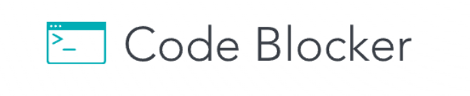

# Code-Blocker

A Chrome extension that helps you prepare for job interviews by blocking distractions and directing you to practice coding questions.

## Table of Contents

- [Features](#features)
- [Installation](#installation)
- [Usage](#usage)
- [The Question Extractor](#the-question-extractor)

## Features



- The extension prevents you from browsing the web by continuously redirecting your current tab to a random LeetCode question until you complete it.
- It prompts you to answer one question per day.
- You can change the difficulty of the current question using the extension's UI.

## Installation

_Note: Currently, the extension is not officially available on the Chrome Web Store, so you will need to manually install it._

1. Download the extension files from the [GitHub repository](https://github.com/Daniel-Toplian/Code-Blocker).
2. Unzip the downloaded file.
3. Open Google Chrome and navigate to `chrome://extensions/`.
4. Enable "Developer mode" by toggling the switch in the top right corner.
5. Click on the "Load unpacked" button.
6. Select the unzipped folder containing the extension files.
7. The extension should now be installed and ready to use.

## Usage

Every day presents a new question. If left unanswered, your current tab will redirect to a LeetCode question whenever it updates (on refresh or navigation to another URL).

## The Question Extractor

Inside this repository, you'll find an ExtractorBot – a Python script used to fetch all the questions from the [NeetCode](https://neetcode.io/practice) website and organize them in a JSON file.
To use the script, navigate to the `Extractor` directory and create your own question JSON file by running the following commands:

```bash
cd QuestionExtractor/
pip install -r requirements.txt
python ExtractorRun.py
```

Feel free to reach out if you have any questions or suggestions.
